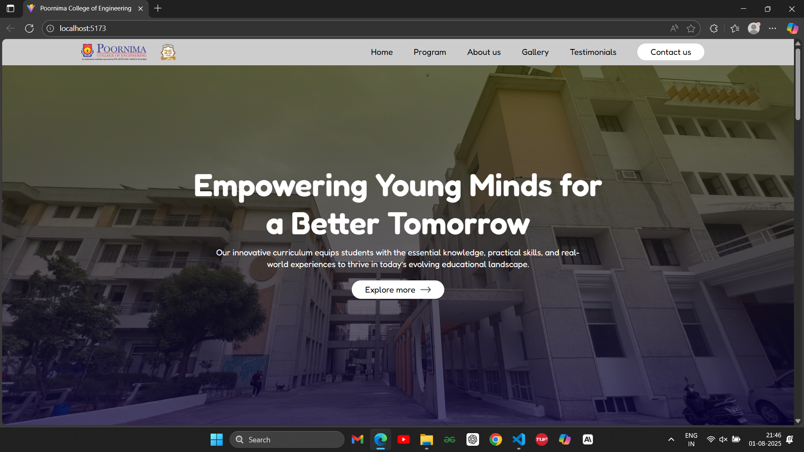
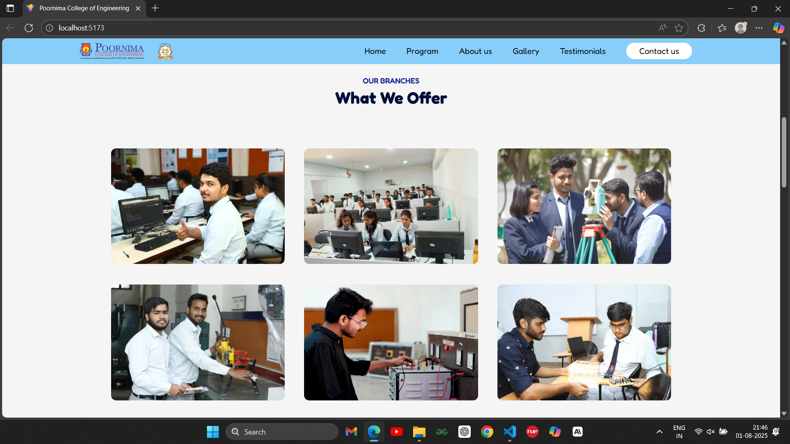
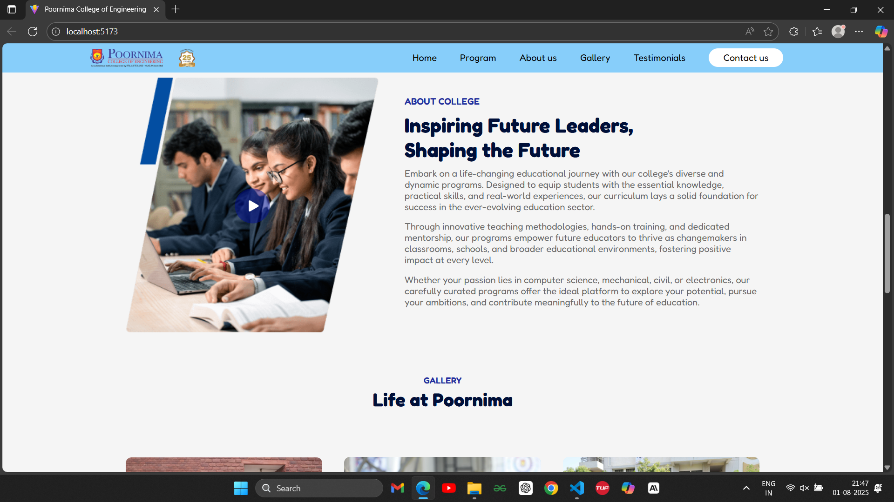
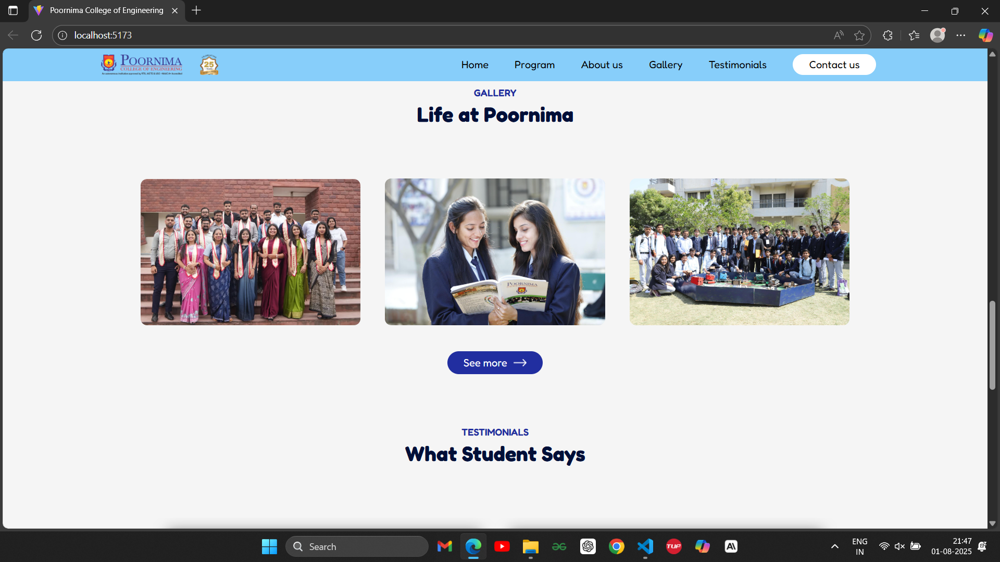
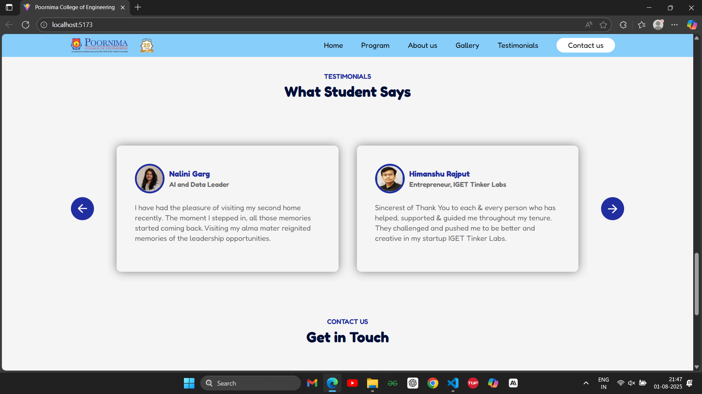
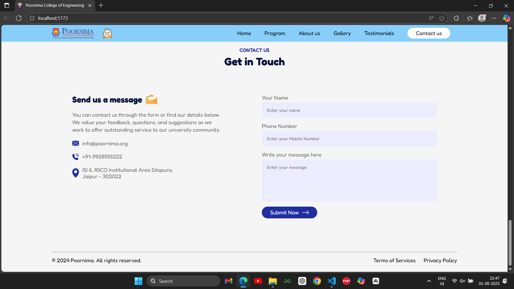

# 🎓 College Website – React.js

A responsive and dynamic **college portfolio website** built using **React.js**, showcasing key sections like About, Programs Offered, Gallery, Testimonials, and a functional Contact Form with email integration. Designed to be visually appealing, easy to navigate, and mobile-friendly.

---

## Features
- **Fully Responsive**: Works seamlessly across all screen sizes and devices.  
- **Navigation Bar**: Includes a sticky navbar with smooth scrolling.  
- **Hero Section**: Engaging landing section for a great first impression.  
- **Programs Section**: Highlights the courses offered by the college.  
- **About Section**: Provides details about the institution.  
- **Gallery**: Displays images of campus life.  
- **Testimonials**: Showcases student and alumni feedback.  
- **Contact Form**: Allows users to send messages directly from the website.  
- **Interactive Video Player**: Users can play and pause an informative video.  
- **Fully Functional Buttons**: All buttons work properly with correct navigation.  
- **Well-Commented Code**: Code is structured with professional comments for better readability. 

## 📂 Tech Stack

- **Frontend:** React.js, HTML5, CSS3
- **Libraries:** react-scroll, Web3Forms
- **Tools:** Git, VS Code

---

## 🧱 Folder Structure

```

College-Website/
│
├── public/
│   ├── index.html
│   └── ...
│
├── src/
│   ├── components/
│   │   ├── Navbar.jsx
│   │   ├── Hero.jsx
│   │   ├── Title.jsx
│   │   ├── About.jsx
│   │   ├── Gallery.jsx
│   │   ├── Testimonials.jsx
│   │   ├── Contact.jsx
│   │   └── ...
│   ├── App.js
│   ├── index.js
│   └── styles/
│       └── App.css
└── ...

````

---

## 📸 Screenshots

| Section | Screenshot |
|--------|------------|
| 🏠 Home Page |  |
| 🏛️ Our Branches |  |
| ℹ️ About College |  |
| 🖼️ Gallery |  |
| 🗣️ Testimonials |  |
| ✉️ Contact Form |  |

---

## 📨 Contact Form Integration

The contact form uses [Web3Forms](https://web3forms.com/) to handle submissions without needing a backend:

```html
<form action="https://api.web3forms.com/submit" method="POST">
  <input type="hidden" name="access_key" value="YOUR_ACCESS_KEY_HERE" />
  ...
</form>
```

---

## 📱 Responsiveness

Every section of this website is fully mobile-responsive using:

* Relative units (`%`, `em`, `vh`, `vw`)
* Flexbox/Grid layout adjustments
* Conditional rendering of hamburger menu in navbar
* Scalable images and forms

---
